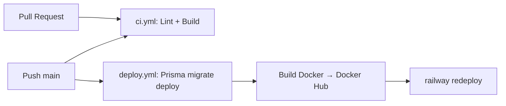

# CI/CD — LIVE VCB

Mô hình CI/CD giống dự án CQA_CRM: **Supabase (PostgreSQL) + Railway (backend) + Vercel (frontend)**.

## Luồng hoạt động

- **`ci.yml`** (BE + FE): chạy khi có PR hoặc push vào `main` — lint, typecheck (FE), build. Chặn merge code hỏng.
  - Riêng FE: bước lint đang **non-blocking** (còn 12 lỗi lint sẵn có từ rule mới của `react-hooks` v7 và các file shadcn/ui). Fix xong thì xóa `continue-on-error: true` trong workflow để lint chặn merge.
- **`deploy.yml`** (BE): chạy khi push vào `main` (hoặc bấm tay qua _Run workflow_), 3 job tuần tự:
  1. **Migrate** — chạy `scripts/ensure-migration-baseline.js` rồi `npx prisma migrate deploy` lên Supabase. Migration chạy **trước** khi deploy code mới.
  2. **Build & Push** — build Docker image, push lên Docker Hub (`<user>/tyv-crm-be:latest`).
  3. **Redeploy** — gọi Railway CLI redeploy service để kéo image mới.
- **FE**: Vercel tự deploy khi push (git integration) — workflow FE chỉ làm CI gác cổng.

## Về migration

- `prisma migrate deploy`: chỉ chạy các migration **chưa được apply** (dựa vào bảng `_prisma_migrations`), idempotent, an toàn chạy lại.
- `scripts/ensure-migration-baseline.js` xử lý 3 tình huống trước khi deploy:
  - DB đã có schema (từng dùng `db push`) nhưng bảng `_prisma_migrations` trống → đánh dấu toàn bộ migration cũ là đã apply (baseline), **không chạy lại SQL**.
  - Có bản ghi migration bị fail dở → xóa bản ghi để deploy lại được.
  - DB đã có lịch sử migration bình thường → không làm gì, để `migrate deploy` chạy migration mới.
- Supabase có 2 loại connection: **pooler** (port 6543, cho app runtime) và **direct** (port 5432, cho migrate). Schema Prisma đã khai báo `directUrl` — nếu không set secret `DIRECT_URL`, workflow tự derive từ `DATABASE_URL` (đổi 6543 → 5432).
- Quy trình dev: tạo migration bằng `npm run prisma:migrate` (tức `prisma migrate dev`) ở local, commit thư mục `prisma/migrations/`, push lên `main` → CI tự apply lên production.
- **Không dùng `prisma db push` lên DB production** — sẽ gây lệch lịch sử migration.

## GitHub Secrets cần set (repo TYV-CRM_be)

Vào **Settings → Secrets and variables → Actions → Secrets**:

| Secret               | Bắt buộc | Lấy ở đâu                                                                                                                                                                                                                                            |
| -------------------- | -------- | ---------------------------------------------------------------------------------------------------------------------------------------------------------------------------------------------------------------------------------------------------- |
| `DATABASE_URL`       | ✅       | Supabase → Project Settings → Database → Connection string (**Transaction pooler**, port 6543). Nhớ URL-encode ký tự đặc biệt trong password (vd `@` → `%40`)                                                                                        |
| `DIRECT_URL`         | ⬜       | Connection string **Session pooler** (host `...pooler.supabase.com`, port 5432). Không set thì tự derive từ `DATABASE_URL`. **Không dùng** host `db.<ref>.supabase.co` — host này chỉ có IPv6, GitHub Actions không kết nối được (lỗi `ENETUNREACH`) |
| `DOCKERHUB_USERNAME` | ✅       | Username Docker Hub                                                                                                                                                                                                                                  |
| `DOCKERHUB_TOKEN`    | ✅       | Docker Hub → Account Settings → Personal access tokens (quyền Read & Write)                                                                                                                                                                          |
| `RAILWAY_TOKEN`      | ✅       | Railway → Project → Settings → Tokens (**project token**, gắn với environment production)                                                                                                                                                            |
| `RAILWAY_SERVICE`    | ✅       | Tên hoặc ID của service backend trên Railway                                                                                                                                                                                                         |

## Setup Railway (làm 1 lần)

1. Tạo service mới: **New → Docker Image** → nhập `docker.io/<dockerhub-user>/tyv-crm-be:latest`.
2. Vào tab **Variables** của service, set env production:
   - `DATABASE_URL` (pooler 6543), `DIRECT_URL` (direct 5432)
   - `PORT=8080` (Dockerfile expose 8080 — hoặc để Railway tự inject `PORT`, app đã đọc `process.env.PORT`)
   - `CORS_ORIGIN=https://<domain-fe-tren-vercel>` (nhiều domain thì phân cách bằng dấu phẩy)
   - Các secret khác app cần (JWT, v.v. — xem `.env` local)
3. Tab **Settings → Networking**: bật Public Domain để lấy URL cho FE gọi API.
4. Tạo **Project Token**: Project → Settings → Tokens → chọn environment production → copy vào secret `RAILWAY_TOKEN`.

Sau đó trên Vercel set:

- `VITE_API_URL=/api` (same-site proxy — Safari nhận cookie `SameSite=Lax`)
- **Không** set `https://…railway.app/api` (BE không có prefix `/api` → lỗi `Cannot POST /api/auth/login`)
- `vercel.json` đã rewrite `/api/:path*` → `https://tyv-crm-be-production.up.railway.app/:path*`

## Deploy thủ công / xử lý sự cố

- **Deploy lại không migrate**: tab _Actions_ → _Deploy Railway_ → _Run workflow_ → tick `skip_migrate`.
- **Chỉ redeploy (không build Docker)**: _Run workflow_ → tick `skip_docker_push`.
- **Migration fail giữa chừng**: chạy lại workflow — script baseline tự dọn bản ghi fail rồi `migrate deploy` chạy tiếp.
- **Rollback code**: Railway → service → Deployments → chọn deployment cũ → Redeploy. (Migration đã chạy thì không tự rollback — viết migration mới để sửa.)
